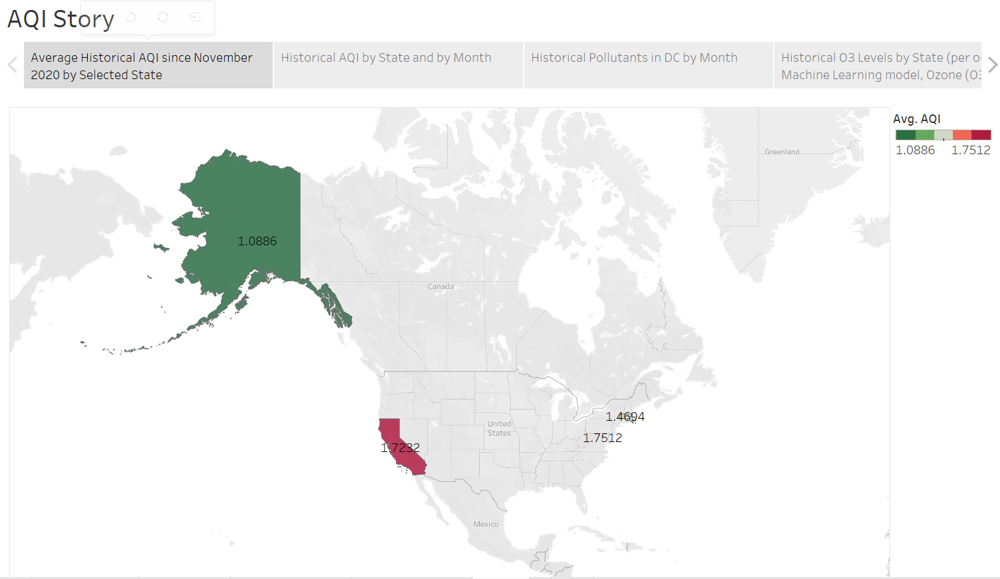

# Overview of Final Project:

## **Segments 1-3:

### **Team**: Elodie Slawinski and Michelle Reilly

### **Communication Protocol**: 
We have agreed on almost daily google hangout video calls in addition to bi-weekly meetings for discussion on Zoom during regularly scheduled class. 
We have held all other communication outside of those sessions on slack, using a group slack from just the team and one with a TA included for questions during the Zoom sessions. 

### **Topic** and **Source of Data**: 
Looking at the pollutants meassured when calculating the Air Quality Index (AQI), using data from the OpenWather Air Pollution API to understand the link between AQI and various air contamenants, and see which air pollutent has the most impact on the weather, so that efforts can be further tailored. We used Google Developers Public Data on coordinates designated as representative for each U.S. state to use as an inital dataframe of coordinates from which we could choose to run through an API call in the OpenWeather API, which houses data for LAT/LONGs accross the globe. 

### **Source of Data**: Data pulled using an API through OpenWeather to retrieve AQI and pollutant readings for close to one year at each location (OpenWeather historical Historical data is accessible from 27th November 2020) 
We created API requests for information for 4 LAT/LONG locations in the States based on personal information of different locations for our sample. We worked on data from 27 Novemeber 2020 to 11 September 2021 (i.e. up to the start data of our project).

#### Background: 
The U.S. Enviornmental Protection Agency establishes an AQI for five major air pollutants regulated by the Clean Air Act. Each of these pollutants has a national air quality standard set by EPA to protect public health. The OpenWeather Air Pollution API "provides current, forecast and historical air pollution data for any coordinates on the globe" (as stipulated on their website here: https://openweathermap.org/api/air-pollution#descr). 

#### OpenWeather classifies Air Quality per the scale below:
- 1 = Good
- 2 = Fair
- 3 = Moderate
- 4 = Poor
- 5 = Very Poor

Besides basic Air Quality Index, the API returns data about polluting gases, such as Carbon monoxide (CO), Nitrogen monoxide (NO), Nitrogen dioxide (NO2), Ozone (O3), Sulphur dioxide (SO2), Ammonia (NH3), and particulates (PM2.5 and PM10).

Air pollution forecast is available for 5 days with hourly granularity. Historical data is accessible from 27th November 2020.

OpenWeather's API considers elements beyond the basic Air Quality Index. Making a request leads to a response that includs data on levels of: 
- Carbon monoxide (CO)
- Nitrogen monoxide (NO)
- Nitrogen dioxide (NO2)
- Ozone (O3)
- Sulphur dioxide (SO2)
- Ammonia (NH3)
- and Particle pollution (also known as particulate matter, specifically PM2.5 and PM10)

### **Project Proposal**: 
There is no doubt that climate change and extreme weathers are of growing concern. Still, with so many factors, and exogenous shocks to diverse data sets to consider, it is difficult to know where to focus remedying energies. Looking at air and the atmosphere exclusively, there is still a lot to consider. 

Using the data associated with these three locations for a year (between Novemeber 2020 and September 2021), we hope to look at trends over a year where quarantines originally limited movement and openings have eased that movement accross the ongoing COVid 19 pandemic. Where/When were there spikes of certain pollutants? Is one pollutant more impactful on the AQI score than others? We chose MA, DC, CA, AK as sample criteria to derive data points to evaluate, given (1-DC) the loaction of this class, (2-CA) current events with wildfires in California, and (3-MA) assumed factory pollution in Massachusettes, and (4-AK) Alaska as a presumed control. 

Data collection was described above under "Topic and Source of Data." Next, we will upload the extracted, cleaned and somewhat tranformed data into a database  in AWS RDS and create a link to pgAdmin. There, we will evaluate if the database needs to be further transformed, and then we will run this database through our Machine Learning model, starting with a Random Forest operator and then a regression model. 

## **Technologies Used**:

### The data exploration process using APIS (Update from Segment 2) 

After settling on a topic we found interesting and relevant, we tried to google and research data that aligned with our interests. We found lots of sources and projects done for India, and then more specific cities elsewhere, but not what we wanted in terms of measurements from our area. We found what we thought was perfect source from the EPA, but ran into technical issues working with it’s API when trying to collect information past one day’s worth of data. Then we found OpenWeather AQI API, looked into the documentation, the data samples, the lat/long way to tailor data outputs. After pairing it with a google data set of 51 lat/longs across the US, we were able to explore different options for pairing down our sample.

### Data Cleaning and Analysis:
Pandas and Requests will be used to clean the data and perform an exploratory analysis from data gathered on APIs. Further analysis will be completed using Python.

### Database Storage:
AWS RDS is the database we intend to use managed through pgAdmin. Although we are also prepared to switch to a different format should colaboration prove to be difficult under this method. We currently have four total tables in our pgAdmin, that start empty with the correct heard names ready to be populated by imported data/a connection. Queries in the OpenWeather_DataBase fi;e and the ML_model file will access information from the database directly into the python script. 

#### Description of how data was split into training and testing sets
Using Skicit-learn to split data of just the features into training and testing sets, and then evaluating the shape of the two to see how the data was split. In the last run, the training data was split with 19920 rows, while the testing data was 6640 rows.

We then applied the Standard Scaler to both given our data for pollutants was collected in different ranges and needed to be mmade more comparable to one another.

### Machine Learning:
After splitting the data and using the StandardScaler, we  used two different type of classifier methods from sklearn's ensemble methods as the primary base of our ML model (see more information on "ensemble methods": https://scikit-learn.org/stable/modules/ensemble.htmlthe).

First, we used RandomForestClassifier to create a supervised learning classifier that uses averaging methods and should reduce vairence, as it is combining diverse trees. With larger training and  testing sets, this model could require much more time for training, as it complies various decision trees to determine the class. Thus, while this model is ideal in helping improve accuracy for the classifying to the output of 5 bin options (1-5 AQI values), and reduces overfitting, it is possile to be less efficient and may be further limited in auto-determining the significance of each variable (creating a  bias).
    More on Mathematics behind AdaBooster's :https://towardsdatascience.com/boosting-algorithm-adaboost-b6737a9ee60c
    More on AdaBoost Model: https://medium.datadriveninvestor.com/understanding-adaboost-and-scikit-learns-algorithm-c8d8af5ace10

Second, we used AdaBoost which instead is a boosting supervised learning classifier aimed to reduce bias and "adapt" around weight values. It goes through many versions of the data sequentially, deriving a predictions from all of them. To create the final prediction in this case, those predictions run through a "weighted majority vote (or sum)."

We then visualized the initial results of  features_importance and permutation_importance through the matplotlib.
    More on permutation importance: https://scikit-learn.org/stable/modules/permutation_importance.html
         - "Permutation importances can be computed either on the training set or on a held-out testing or validation set. Using a held-out set makes it possible to highlight which features contribute the most to the generalization power of the inspected model."
    More on feature importances: https://scikit-learn.org/stable/auto_examples/ensemble/plot_forest_importances.html

### Dashboard:
We incorporated this information into a visualizations made on Tableau which we can export for a great presentation. 
The presentation is uploaded here in a powerpoint format. We also generated an ERD from pgAdmin and uploaded the graphic into the same power point. We also included screenshots of graphs generated at the end of the ML Model that did the final impact testing after scaling all the features (aka the pollutants). 

Tableau Story Link: https://public.tableau.com/app/profile/elo.sla/viz/Final_Project_AQI_Story/AQIStory?publish=yes

## Presentation Practices Were Not Recorded. Please Refer to Notes at the Bottom of Each Slide.(September 26 2021 Update for Segment 3)
Final Presentation date set for 29 September 2021 between 7 - 9 pm EST.
